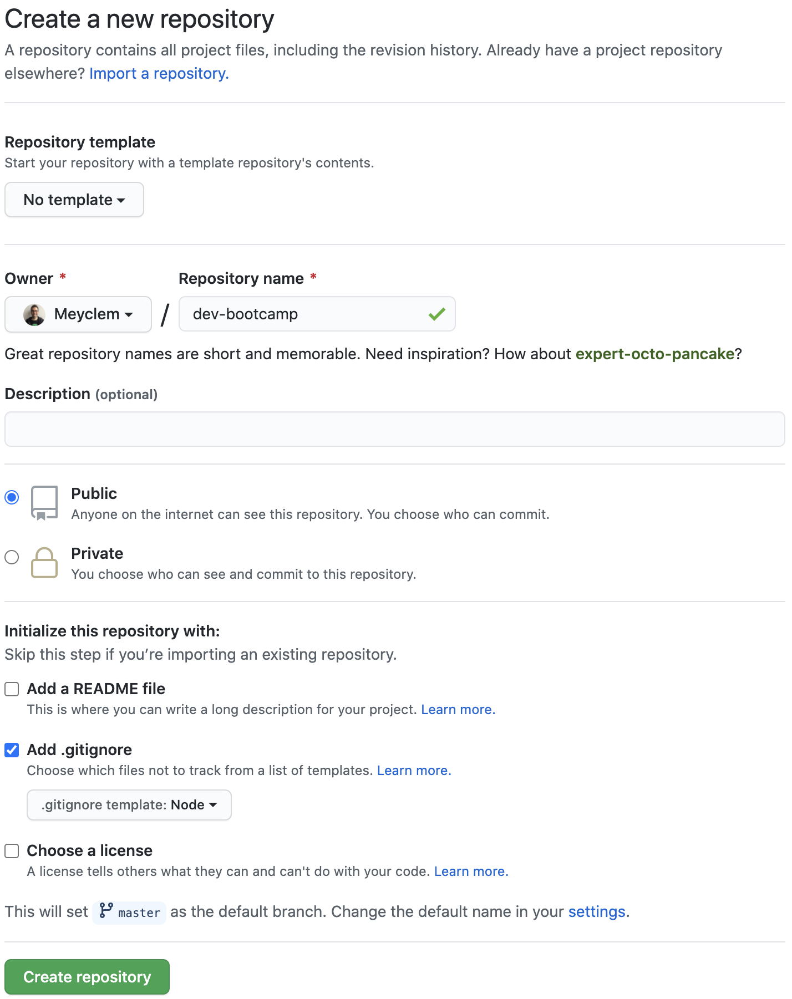

# Getting started

## Sparta CLI

`sparta-cli` is a Brew package that will allow you to manage the exercises repository during the bootcamp.

### Installation

In your terminal, run:

```bash
$ brew install fewlines-education/tap/sparta-cli
```

Then, you can use the command `sparta`. Try it:

```bash
$ sparta help

Sparta CLI

VERSION
  sparta/1.0.0 darwin-x64 node-v12.16.2

USAGE
  $ sparta [COMMAND]

COMMANDS
  help   display help for sparta
  init   Initializes the Sparta workspace
  sync   Updates all the exercises for the past days
  today  Downloads the exercises for the current day
```
> As you can see, you have 4 available commands!

### Exercises repository creation

To start, run:
```bash
$ sparta init
What is the ID of your batch ?: <batch_id>
Enter the Sparta secret token: <secret_token>
```
> We will give you `batch_id` and `secret_token` on Slack ...
> ... And follow the flow 🚀

You will be asked to create a blank github repository with a `.gititnore file`, do it like this:



go the newly created `/Users/<your_name>/workspace/fewlines-education/exercises` directory and add the `git remote`, as asked in the instructions.

Then, in the `.gitignore` file, add the following:

```
*.DS_Store
node_modules
```

Now, it's time to commit this change:

```bash
$ git add .gitignore

$ git status # Check that only the .gitignore is added

$ git commit -m "exercises repo creation"

$ git push origin master
```

### Get the exercises for the day

Each day you will have to download the exercises for the current day. To do it:

```bash
$ sparta today
```

🔎 Then, look inside your `exercises` directory! 🔎

```
exercises
└── 02_programming_fundamentals
    └── 03_algorithms_day_1
```

`03_algorithms_day_1` is the folder you need to use today.
Inside, you'll have a directory named **`current`**, navigate to it and see what you have to do today:

```bash
exercises
└── 02_programming_fundamentals
    └── 03_algorithms_day_1
        └── current 👈 # HERE!
             ├── 00_getting_started
             ├── 01_play_with_variables
             ├── 02_play_with_arrays
             ├── 03_play_with_conditional_statement_drink
             ├── 04_play_with_conditional_statement_exoplanets
             ├── 05_play_with_for_loop
             ├── 06_play_with_for_loop_bonus
             └── 07_pattern_bonus
```

## Context and Objectives

This exercise is an introduction to solving efficiently exercises.

## Specs

With your terminal, navigate with the command `cd wantedRepository` to enter a repository.
You can then navigate to the exercise folder which usually starts with a number, followed by the name of the exercise.

**Note**: Use the command `ls` in your terminal to see a list of all the files and folders at your current location.

In the `src` repository, open the `index.js` file and code the following specifications:

- The variable `booleanVariable` must be given a boolean value `true`;
- Uncomment the ligne `// const nullVariable = null;` by deleting the characters `//`;
- The variable `greetingVariable` must be given the string value `"Hello World!"`.

Once you are done, you can launch tests by executing the command `yarn test` from the exercise repository.

Once the tests are all passed, you can move on to the next exercise!
Don't hesitate to ask for help to your teachers!

Have fun!!
