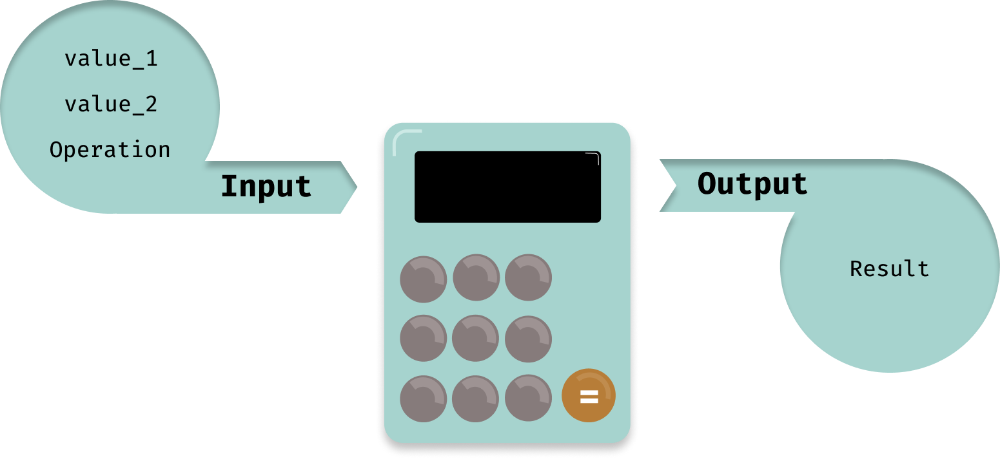

# Calculator

## Explanation and PseudoCode

Let's think about the calculator as a **program**.



Well it sure is a very _simple_ calculator but it does the job!
But where do we start now?

### Writing a Pseudo-Code

Summarise in a few lines the big main flows of data and jobs of the program.

```python
1. The user turns on the calculator
2. The calculator waits for the user to enter a number
3. The calculator waits for the user to enter an operation
4. The calculator waits for the user to enter a second number
5. The calculator make the operation like this :
        read 'input 1' and 'input 2'
            read 'operation'
                if "addition"
                    print 'input 1' + 'input 2'
                if "subtraction"
                    print 'input 1' - 'input 2'
                if "multiplication"
                    print 'input 1' * 'input 2'
                if "division"
                    print 'input 1' / 'input 2'
```

## First step

First, we need to get the first user input. To do so, we'll use `readline`:

```js
import readline from "readline";

const reader = readline.createInterface({
  input: process.stdin,
  output: process.stdout,
});
```

We can now use the reader to ask information to the user:

```js
reader.question("Enter the first number\n> ", (firstNumber) => {
  // What to do after we got the firstInput?
});
```

## The MVP

MVP stands for **M**inimum **V**iable **P**roduct. It is the first working version on an application.
Most of the time, it just works with the bare minimum functionalities. In the Calculator case:
- ask for numbers and operator.
- compute an operation.
- display the result of the operation.

At the end your MVP should work pretty much like this when using `yarn start`:

```
Ready to compute operations!
****************************

Enter the first number
> 1
Choose an operation: [ + - * / ]
> +
Enter the second number
> 3

1 + 3 = 4
```

Look in the `src/index.js`. You'll see for the program to work well, you'll need to code and export the `calculator` function in the `src/calculator.js` file.

### Bonus: Follow up

When this is done, You still have work to do:

### Numbers

For now, your calculator should only accept integers. But how should we handle floats or negative numbers?

Did you use `parseInt`? What if we use `parseFloat` instead?

```js
parseInt("1.2");    //  1
parseInt("-1.2");   // -1
parseFloat("1.2");  // ❓
parseFloat("1,2");  // ❓
```
> Hint: How to handle the `,` case?

### Wrong inputs

Very often your users will make mistakes. It's better for you to inform the user that a mistake has been made and ask him or her to try again rather than let the program crash and the user has to start again from the beginning.

It's way better to inform the user that an error occurred and let her or him try again:

```js
Waiting for first number
> a
Wrong input!
Waiting for first number
> 123
Choose an operation: [ + - * / ]
> (
Unknown operation..
Enter a valid command [ + | - | * | / ]
Choose an operation: [ + - * / ]
> +
Waiting for second number
> a
Wrong input!
Waiting for second number
> 123

123 + 123 = 246
```
