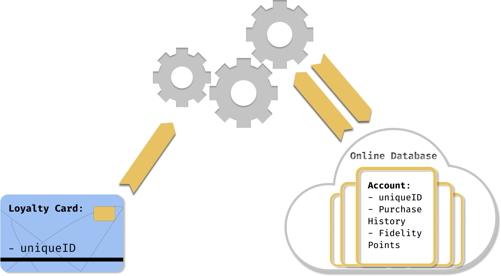

# Loyalty Card Manager 📇🗃️

Let's think about the loyalty card system as an **interface** and a **program**.



## Functionalities

### Interface

The user needs to interact with the program. To do so, he needs an interface.

Use readline to create one:

```
Welcome
********************************************************
1 - Add new customer
2 - Access customer data
3 - Quit

🤖 Choose an action
>
```

### create a new customer

```
********************************************************
CREATE NEW CUSTOMER
********************************************************

🤖 - first name:>
> John

🤖 - last name:>
> Doe

🤖 - email:>
> jon.doe@fake.local

🤖 - birth date:>
> ??/??/????

🤖 - city:>
> Somewhere

🤖 - country:>
> Else
```
It should then be possible to see a list of customers:

```
********************************************************
CHOOSE A CUSTOMER
********************************************************
1 - Alice Cooper
2 - Bob Sponge
3 - Charlie Andthechocolatefactory
4 - John Doe

🤖 Choose a customer
> 1

********************************************************
ALICE COOPER
********************************************************
1 - Show account
2 - Add purchase
3 - Use fidelity points
4 - Show purchase history
5 - Choose another customer
6 - Back to menu
7 - Quit

🤖 Choose an action for Alice Cooper
>
```

### Show customer account

Your user needs to get information about a customer:

```
********************************************************
ALICE COOPER'S INFORMATION
********************************************************
Customer information:
Name:             Alice Cooper
Email:            alice.cooper@fake.local
Address:
 - City:          New York
 - Country:       United States of America
Total purchase:   1529
Fidelity points:  76.45
```

### Add a new purchase

A purchase is defined by two things:
- the current date
- the amount

```
********************************************************
ALICE COOPER - ADD PURCHASE
********************************************************

🤖 Purchase amount
> 400
```

### Purchase history

The user must be able to access to the history of all purchases made by the customer:

```
********************************************************
ALICE COOPER'S PURCHASE HISTORY
********************************************************
12/12/2000 - 200€
12/12/2001 - 400€
12/12/2002 - 600€
24/12/2019 - 400€
```

## Writing a Pseudo-Code

Each function looks abstract and unclear at the moment but hang on! The features are present, and this reminder will help to keep a fixed and comforting coding environment while working!

Do you start feeling our direction and how we can handle this problem? 

## Code

Now you have an idea of how to do things, **it's time to code!**

### Readline

Remember how to use readline?

```javascript
import readline from "readline";

const reader = readline.createInterface({
  input: process.stdin,
  output: process.stdout,
});
```

### Uuid

An uuid is a unique string. To identity the customers, use uuid to create their id:

```javascript
import * as uuid from "uuid";

const id = uuid.v4() // af7bce0f-0f44-4b54-b333-7ea46ddb5b3d
```
---

## Good Luck !! 💪
