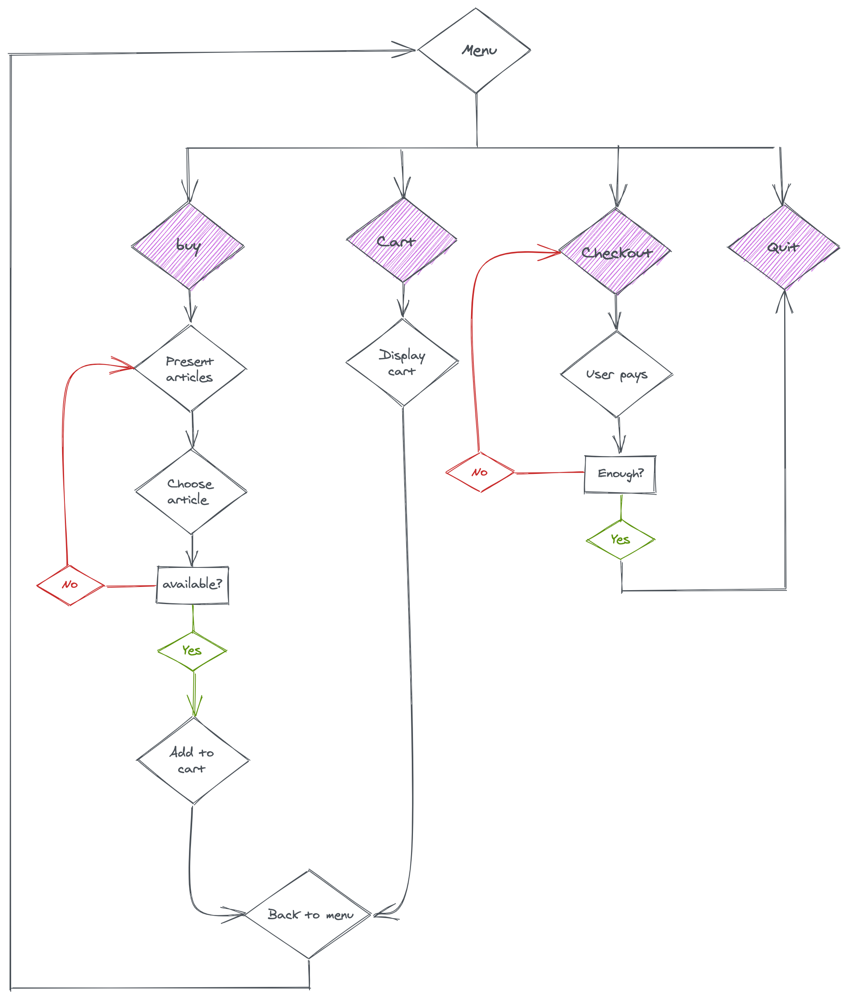

# E-Commerce

If you already bought something on the internet, you probably know what an e-commerce website is: they allow you to search and buy products!

Of course, we would need some kind of interface and what we call a **business logic**!

We want you to code the kind of interfaces that had to be programmed in old computers before the mouse was even a thing, where the only thing they could do was display text and read text back.

## Specs

Let's see first what our e-commerce flow should look like:



When the user start the application, it's logical to present the menu.
The user has then to choose the next operation:

- Buy a product.
- Display the cart.
- Checkout the bill.
- Quit the program.

But inside each of those steps, there are things to do!

### Menu

This is what your Menu should pretty much look like:
```
**************************************************
MENU
**************************************************
1 - Buy a product
2 - Show cart
3 - Checkout
4 - Quit
Choose an action
>
```

The user has to choose a number, then, the program execute the corresponding part of the code.


### Buy a product

```
**************************************************
SHOP
**************************************************
1 - beer: 4€ (quantity: 300)
2 - chips: 2€ (quantity: 25)
3 - cheese: 3€ (quantity: 50)
4 - olives: 1€ (quantity: 200)
5 - waterBottle: 0.5€ (quantity: 1000)
6 - back to menu
7 - quit
Choose a product
> 5
How much?
> 5
```
> Beware of the available quantity! What to do if there's not enough water? 😱.
> Of course, if the customer buys all the chips, there won't be any for the next customer 😉.

As you can guess, this is also the time to think about the data structure:
- Which data type should you use to store **all** the articles?
- Which one to represent **a single** article?

### Display the cart

```
**************************************************
CART
**************************************************
1 - chips: 2€ (quantity: 2)
2 - waterBottle: 0.5€ (quantity: 5)
**************************************************
TOTAL: 4.5 €
**************************************************
1 - Back to menu
2 - Quit
Choose an action
>
```

Nothing fancy here, just the total of the products and a readable display!
But... How to compute the sum?

Yeah! You guessed it, we need to handle the cart!

### Checkout

The paiement part where you ask your customer how much they will give to the cashier (for instance, they pay their 34 euros cart with a 50 euro bill).

What if the sum is too high? Too low?

```
**************************************************
CHECKOUT
**************************************************
1 - chips: 2€ (quantity: 2)
2 - waterBottle: 0.5€ (quantity: 5)
You have to pay: 4.5 €
> 4.5 1️⃣
```
> 1️⃣ the sum the user gives to the cashier.

### Quit

```
Thank you!
**************************************************
GOODBYE!
**************************************************
✨  Done in 745.43s.
```

Even here there is something to do. How will you manage if the customer try to quit without paying?

What do to when the customer has paid and the next one comes?

## Tests

There are no tests for this exercise. Your program "just" has to work 😉.
