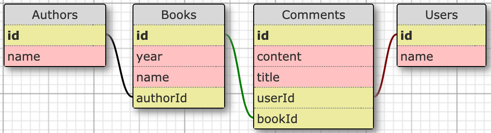

# Book API

## Context and objectives

In this exercise you will have to code functions to consume the given **Book API**. But for this, you'll first have to read its documentation.

## Book API documentation

### Database Schema



Resources:
- Authors:
  - Each author have written several books.
- Books:
  - Each book have been written by one author.
  - Each book may have several comments written by one user.
- Users:
  - Each user may have written several comments on different books.
- Comments
  - Each comment have been written by one user.
  - Each comment is linked to one book.

### Routes

```bash
# Authors
GET /authors # all authors
GET /authors/:id # one author by id
GET /authors/:id/books # author's books
GET /authors?q=<name> # authors by name

# Books
GET /books # all books
GET /books/:id # one book by id
GET /books/:id/comments # book's comments
GET /books?q=<name> # books by name

# Users
GET /users # all users
GET /users/:id # on user by id
GET /users/:id/comments # user's comments
POST /users # creates one user
PATCH /users/:id # update one user by id
DELETE /users/:id # delete one user by id
```

### User creation

In order to create a user you will need to make a `POST` request to `/users` with the following body:

```bash
{
  name: <userName>
}
```

### User update

In order to update a user you will need to make a `PATCH` request to `/users/:id` with following body:

```bash
{
  name: <userName>
}
```

## Specs

To complete this exercise you will have to write all needed requests.

**This is a lot of code to write**. But hey! It's time to really use the developper's best friend: `COPY / PASTE`!!

### Repositories
In the `src/repositories` folder you have three files to write code in:
- `AuthorRepository.ts`
- `BookRepository.ts`
- `UserRepository.ts`

As you can guess, each file contains a `class` and is dedicated to a specific resource. In each one, you'll have to code functions on this model:

```ts
import * as request from "request"

class Repository {
  baseUrl = process.env.BASE_URL

  neededFunction(parameter: ParameterType): FunctionReturnType {
    // Needed code to make the function work properly
  }

  OtherNeededFunction(parameter: ParameterType): FunctionReturnType {
    // Needed code to make the function work properly
  }
}

export { Repository }
```

#### AuthorRepository

code the following functions:

**`getAll`**

get all authors.
function parameters:
- `callback`: function.

**`getOne`**

get one author by id.
function parameters:
- `id`: number.
- `callback`: function.

**`getAuthorBooks`**

get all books for one author.
function parameters:
- `id`: number.
- `callback`: function.

**`searchByName`**
get authors by name.
function parameters:
- `term`: string.
- `callback`: function.

#### BookRepository

code the following functions:

**`getAll`**

get all books.
function parameters:
- `callback`: function.

**`getOne`**

get one book by id.
function parameters:
- `id`: number.
- `callback`: function.

**`getBookComments`**

get all comments for one book.
function parameters:
- `id`: number.
- `callback`: function.

**`searchByName`**

get authors by name.
function parameters:
- `term`: string.
- `callback`: function.

#### UserRepository

code the following functions:

**`getAll`**

get all users.
function parameters:
- `callback`: function.

**`getOne`**

get one user by id.
function parameters:
- `id`: number.
- `callback`: function.

**`getUserComments`**

get all comments written by one user.
function parameters:
- `id`: number.
- `callback`: function.

**`create`**

Create a user.
function parameters:
- `params`: object.
- `callback`: function.

**`update`**

Update a specific user.
function parameters:
- `id`: number.
- `params`: object.
- `callback`: function.

**`delete`**

Delete a specific user.
function parameters:
- `id`: number.
- `callback`: function.

### Constraints

**Request**

You **must** use the `request` package inside your functions.
For this exercise, because we have to make `GET`, `POST`, `PATCH` and `DELETE` requestsn don't provide directly the url as a string but rather give it an object as first argument as follows:

```js
const options = {
  url: '<url>',
  method: '<METHOD>', // can be one of GET | POST | PATCH | DELETE
  // Other options
};

request(options, (error, response, result) => {
  // you code goes here
});
```

If you need you can find all available options **[here](https://github.com/request/request#requestoptions-callback)**. (Spoiler: You'll need them for `POST` and `PATCH`)

**Callbacks**

In each of your functions you have to pass a `callback` function as **third parameter**. Each time, parse the resquest's result and give it as its argument like this:

```js
request(options, (error, response, result) => {
  // your code
  callback(/* Give the parsed result here */)
  // your code
});
```

### Setup

The API is not on a distant server, it's right here, in your folder. To start it:

```bash
# get the process.env.BASE_URL available in your code
source .env_vars

# start the server
yarn start # => http://localhost:9999
```

⚠️ You'll need to let it turned on, so start it in a new terminal window.

### Tests

To launch tests, just `yarn test`.
