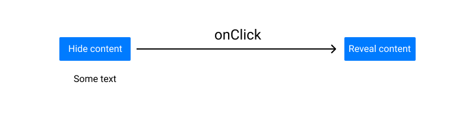

# Basic component

## Context and objectives

Creating components with React can be complex, but for now, let's go with a basic one!

## Specs

In this exercise you have to create this component:

In the `src/components/HideOrNotHide.jsx` file, write your first React component.

It should contain a **button** (`<button></button>`) and a **paragraph** (`

`).

When the page loads, the paragraph should be visible, and clicking on the button should:
- change the button's text.
- hide the paragraph.

💡 To make that happen, you'll have to use both the `useState` hook and the `onClick` property.

⚠️ The goal is not to hide the paragraph with CSS but with React
