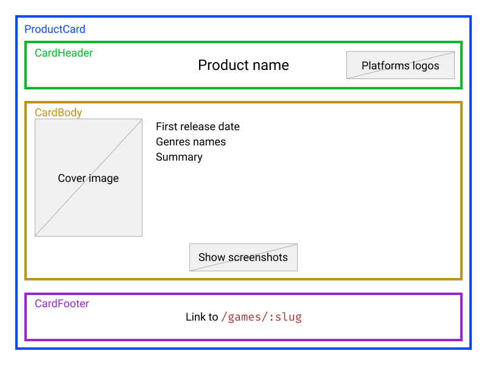

# Product Card

## Context and objectives

Product cards are a front-end component we see a lot when browsing the web.

It is useful to display some information about a product.

## Specs

This exercise is not focus on adding style to a component but here is an exemple of what you could achieve in this exercise if you want.

First, have a look at the data in `data/zelda.js`. This is the product which will be passed to your `ProductCard` component as `props` in `src/App.jsx`.

[Bootstrap](https://getbootstrap.com/docs/4.5/components/card/) has been added to the base html document, so don't hesitate to use it.

Keep in mind that you shouldn't spend too long on making this card beautiful, but feel free to pimp it a bit 😉

The card shown above is made of three parts:
- A header
- A body
- A footer

Each part must be a different component and they must display informations like this:

The `src/components` folder contains four files:
- `index.jsx` the main file to import from when using the `ProductCard` component.
- `header.jsx` exports the `CardHeader` component.

  It must display:
    - product name
    - platforms logos
- `body.jsx` exports the `CardBody` component.
  
  It must display:
    - product cover
    - game first release date
    - genres names
    - game summary
    - a **unique** button which hides or shows screenshots on click. Screenshots must be displayed in in the body.
- `footer.jsx` exports the `CardFooter` component.

  It must display a link to `/games/:slug`.

## Tests

As always, `yarn test` to test your code, and you can also `yarn start` to launch the app in your browser.
