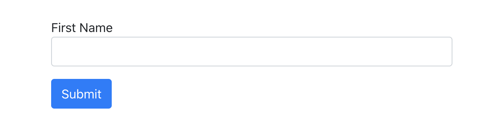
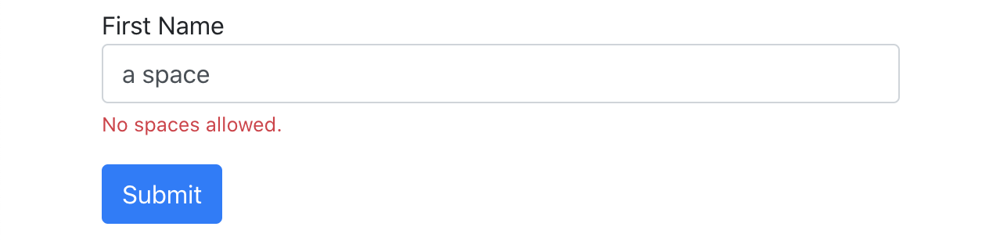

# Forms Validations

## Context and objectives

Forms are quite a common thing to see on web applications. They can be used for search bars, contact forms, login or signin forms, etc...

We don't want our users to input anything in them before sending us the data. What we DO want is something to verify and validate user inputs, pretty much as we did with `readline` in CLI, but fancier!

## Documentation

Before diving in, please read these two parts of the React documentation:

### Events

Handling [events](https://reactjs.org/docs/handling-events.html) is a common thing too.

Most of interactive elements have a default behaviour. For example, links lead to another url and forms have an action property which is also redirecting the user on submit.

Have a close look to `e.preventDefault()` to learn how to disable this default behaviour.

### Forms

Look at the [React Forms documentation](https://reactjs.org/docs/forms.html) but note that it shows `Class` components whereas we want `Functional components` 😉.

## Specs

In this exercise you have to build a simple form with one **first name** field and one submit button in the `src/components/Form.jsx` file. It is already imported and used in `src/App.jsx`.

You can copy / paste the base markup coming from [Bootstrap components](https://getbootstrap.com/docs/4.5/components/forms/#overview) and then modify it to match your needs.

Because [Bootstrap](https://getbootstrap.com/) is set up in the exercise folder, it should look something like that:

### Validations

When the user inputs something, if there's any space in it, the form must display **this** error: `No spaces allowed`, like below:

You have two ways of validating an input:
- when the user enters something, during the `onChange` event on the input
- when the user submits the form by pressing enter or clicking on submit.

## Tests

As always, `yarn start` to start the app and `yarn test` to test your code!
