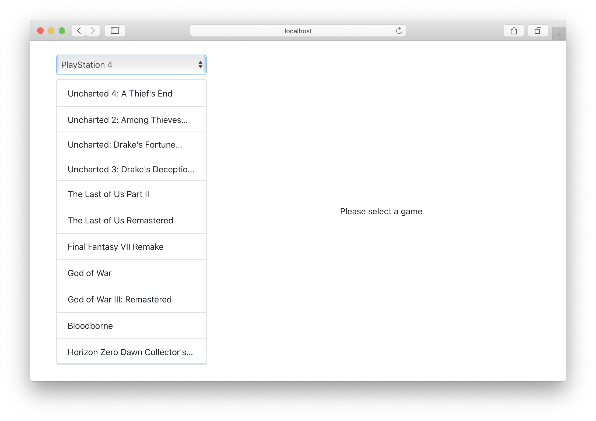
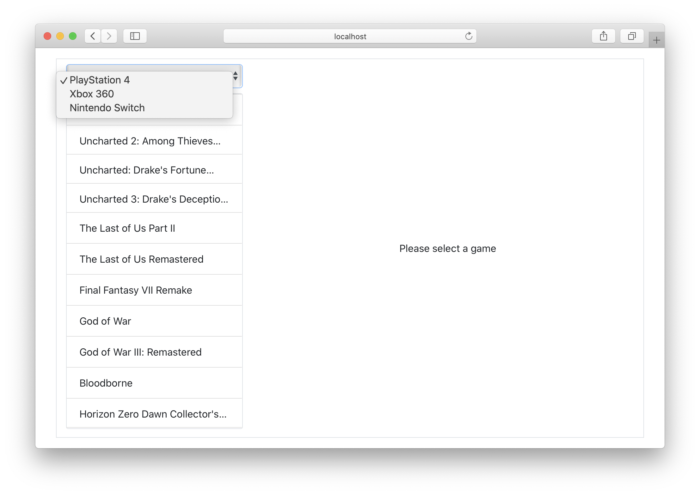
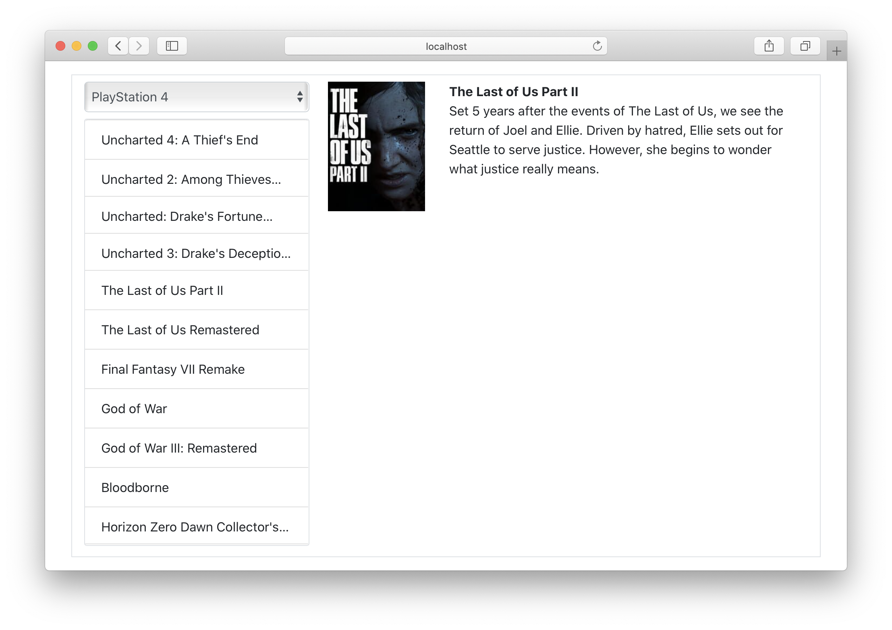

# Interact with APIs

## Context and objectives

As you've probably guessed, we will use APIs a lot when working with React. Whether `GET` requests or `POST` requests, we will communicate with APIs from our components:

- Get products information.
- Get users data.
- Send data from forms to the server.
- etc...

## Specs

In this exercise you will have to create a component that will communicate with the [Video-games api](https://videogames-database.herokuapp.com/).

You will only need to use these two endpoints:
- `GET /platforms`
- `GET /games/:slug`

Remember to use `"Accept": "application/json"` in the headers of your requests to get the `json` data.

You will have to code inside the `src/components/PlatformPage` folder and the `index.tsx` file must export your main component: look how we call it in `src/App.tsx`:

```ts
// App.tsx

import PlatformPage from "./components/PlatformPage"; 👈

export const App: React.FC = () => {
  return (
    <div id="app" className="container default-flex">
      <PlatformPage /> 👈
    </div>
  );
};
```

### Get platforms data

Your component must fetch data from the platforms endpoint when it is mounted in the page inside a `useEffect` hook.

When the data is fetched, display it pretty much like this:


The platforms names are used in a select tag so the user can choose between the platforms:


> Have a look at the React documentation about [select tags](https://reactjs.org/docs/forms.html#the-select-tag).

As you can see, you also must display the associated games in a list: use [Bootstrap' list component](https://getbootstrap.com/docs/4.4/components/list-group/#basic-example) and display each game's name in a `.list-group-item` element.

When the select's value changes, you need to use the `onChange` event to present the data of the selected platform to the user. To do that, you will also need to use the `useState` hook.

### Get a specific game's data

Each of your `.list-group-item` elements should handle a click event: when a game element is clicked, a request must be fired to get the selected game's information from the `games/:slug` endpoint.

You then have to display it:


> You need to display at least the name, the cover and the summary of the game.

### Types

You will need to type platforms and games. You can use the type definition in `src/types/Platform.d.ts`.

### Style

Don't spend too much time to manually write css and prefer using Bootstrap to get a quick and nice style.

## Tests

Not as usual today, to run tests, use `test:e2e`! It will need the server to be running to work: this exercise uses **end to end** tests meaning they will act as a user:

- go the the `http://localhost:8080` url.
- change the selected platform, check if it changes the display.
- click on a game element and check if the data display's correctly.

**Tests will also take more time to execute**, don't be surprise.

Of couse, you can use `yarn start` to start the application and see by yourself what your users will get.
